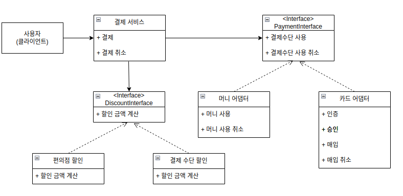

1. 프로젝트 설명 
- 편의점 결제 서비스 '편결이' : 사용자가 편의점에서 간편결제로 결제할 수 있는 시스템 개발
- 사용자 -> 편결이 -> 결제수단 시스템(기존 활용) 호출

2. 순서
- 순수 자바로된 프로젝트 생성
- 직접 심플 스프링 만들어보기
- 스프링을 활용해 만든 프로젝트 동작하도록

3. 환경
- Ubuntu
- JAVA(jdk11)
- Gradle Project
- Spring Boot 2.6.4
- start.spring.io 활용

4. 요구사항
- 편의점 결제
- 편의점은 G25, CU, 세븐
- 카드 결제 추가 : 머니나 카드 선택시 해당 결제수다능로 결제되도록
- 할인 기능 추가 -> 명확한 정책이 아직 결정되지 않음

5. 요구사항 분석 결과
- 편의점은 정해져있으니 enum으로 관리
- 결제수단은 일단 money만 사용 -> 사용자의 결제 요청에따라 결제수단 정보 추가 (머니/카드)
- 결제 수단 나중에 추가되도 개발 편하도록 => 어댑터들이  Interface 지키도록
- 먼저 개발하고 있다라가 나중에 정책이 정해지면 구현체 선택 => 정책별 클래스 구현

6. 클래스 UML

7. SOLID 원칙
- 어떤 클래스가 어떤 구현체를 사용하는지 -> 설정을 별도의 클래스로 분리

